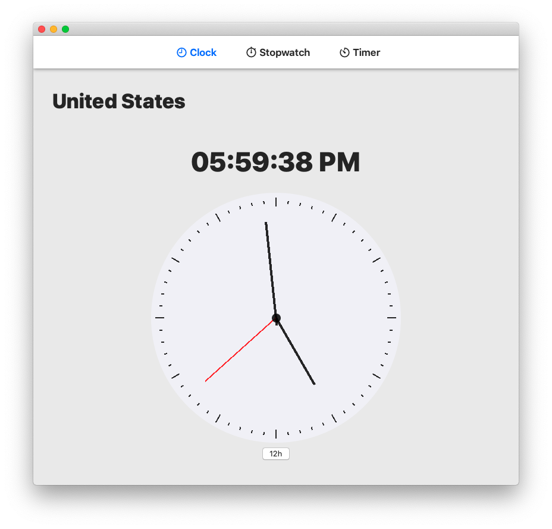

## Welcome to Time Pro

This is an app that displays time and has a stopwatch. Currently under development.

Made entirely with `SwiftUI`.

 

## Features:
* A beautiful Analog Clock
* A nice Stopwatch

Install
-
Get Time Pro for macOS [here](https://github.com/savagegod22/Time-Pro/releases). Just open the DMG file and drag the app to the icon of the Applications folder.

When you try opening it, it will say `“Time Pro can’t be opened because Apple cannot check it for malicious software,"` but you can ignore that, because this app doesn't have a virus.

To fix that, go to System Preferences, Privacy, and then General. Next, press open anyway in the bottom. This app does not contain a virus. Enjoy!

## To do:
- [ ] Add Timer
- [ ] Add an Alarm
- [x] Add Stopwatch
- [x] Add app to Releases

Thanks to OrangeFlavoredDerek's [Analog-Clock-SwiftUI-2.0-](https://github.com/OrangeFlavoredDerek/Analog-Clock-SwiftUI-2.0-) for some of the Clock code.

Thanks to Shubham0812's [Timer_SwiftUI](https://github.com/OrangeFlavoredDerek/Analog-Clock-SwiftUI-2.0-) for some of the Stopwatch code.
